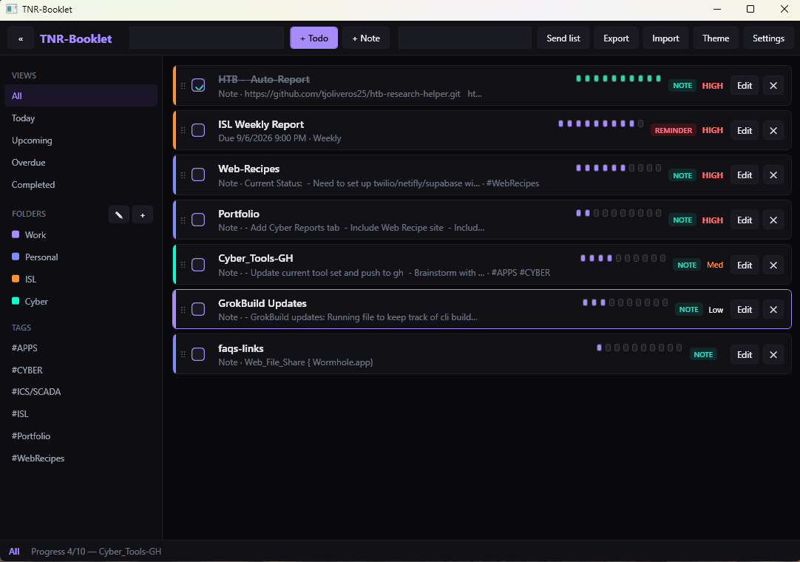

# TNR-Booklet

**TNR** stands for **Todo / Notes / Reminders**.

Local Windows app for those three things in one booklet. Nothing is uploaded. No account.



Reminders still fire when the window is closed (Windows Task Scheduler). Optional Telegram and Discord messages go out only; tokens stay on this PC.

**Windows 10 or 11 only.** License: [MIT](LICENSE).

---

## Run

1. Install the [.NET 9 SDK](https://dotnet.microsoft.com/download/dotnet/9.0) (or the .NET 9 desktop runtime if you already have a built exe).
2. Double-click `Run-TNR-Booklet.bat`.

That builds a Release copy if the SDK is present, then launches TNR-Booklet.

From a terminal in this folder:

```powershell
dotnet build TnrBooklet.sln -c Release
dotnet run --project src/TnrBooklet/TnrBooklet.csproj -c Release
```

Publish a self-contained exe:

```powershell
dotnet publish src/TnrBooklet/TnrBooklet.csproj -c Release -r win-x64 --self-contained true -o publish
```

Then run `publish\TNR-Booklet.exe`.

---

## What it does

- Folders and tags (Work / Personal to start, plus your own)
- Todos and notes (notes skip due dates and reminders)
- List badges: **TODO** (amber), **NOTE** (teal), **REMINDER** (rose)
- Views: All, Today, Upcoming, Overdue, Completed
- One-shot and repeating reminders
- Toast, sound, tray, close-to-tray
- Theme editor
- JSON export / import (bot tokens and webhook URLs are not written into exports)
- Optional Telegram + Discord

---

## Reminders

Time is **24-hour** (`09:05` or `21:30`, not 9:05 PM). Date and time sit side by side on the todo editor.

While TNR-Booklet is open it watches the clock. If you close it, Windows Task Scheduler still starts it at that time. Look under **Task Scheduler Library → TNR-Booklet**. Turn this off in **Settings** if you only want alerts while the app is running.

---

## Data (this PC only)

Default folder:

| Path | Purpose |
|------|---------|
| `%LocalAppData%\TnrBooklet\tnr-booklet.db` | Tasks, folders, tags |
| `%LocalAppData%\TnrBooklet\settings.json` | Settings and local messaging secrets |
| `%LocalAppData%\TnrBooklet\themes.json` | Themes |

**Settings → Data folder** shows the live path, lets you open it, and lets you pick another folder (USB drive, second disk, and so on). The chosen path is stored in `%LocalAppData%\TnrBooklet\data-location.txt`; the database and settings then live in that folder.

If you used an older install, existing data under `%LocalAppData%\Focus\` is moved into the default folder on first launch.

---

## Messaging (optional)

Secrets stay in `%LocalAppData%\TnrBooklet\settings.json`.

**Telegram:** [@BotFather](https://t.me/BotFather) → `/newbot` → copy the token. Message your bot `/start`, then open `https://api.telegram.org/bot<TOKEN>/getUpdates` and copy `"chat":{"id": ...}`. In **Settings**, paste token + chat id → **Save** → **Test send**.

**Discord:** Channel → **Edit channel → Integrations → Webhooks**. Paste the URL in **Settings** → **Save** → **Test send**.

**Send list** on the toolbar posts today’s open tasks on every enabled channel.
